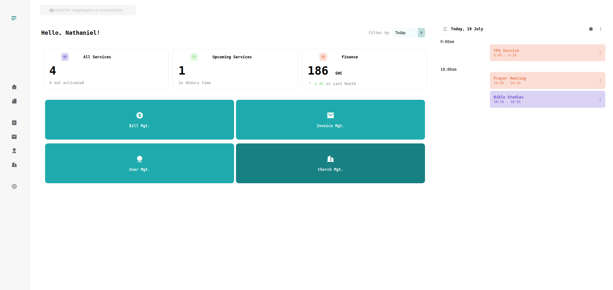
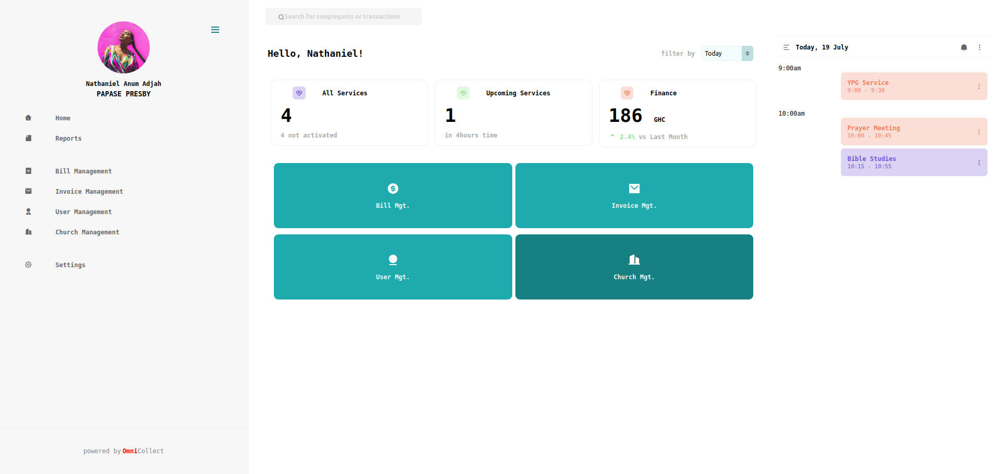

# Church Management Application





## Project setup
```
npm install
```

### Compiles and hot-reloads for development
```
npm run serve
```

`NB` Incase you encounter an error with `digital envelope routines::unsupported`, enable the `--openssl-legacy-provider` option in NODE
and then run `npm run serve`

```bash
export NODE_OPTIONS=--openssl-legacy-provider
``` 

### Compiles and minifies for production
```
npm run build
```

### Customize configuration
See [Configuration Reference](https://cli.vuejs.org/config/).
